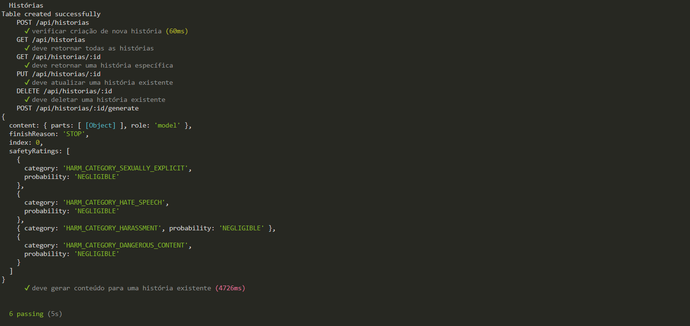

# Construção de uma API com Integração para Geração de Histórias

Esta é uma API para gerenciar histórias, integrada à API do Gemini para geração de conteúdo textual. Nela é possível criar, ler, atualizar, deletar e gerar conteúdo para histórias. A seguir, é apresentado uma descrição para instalar as dependências e rodar a API. 

## Instalação

### Pré-requisitos

- Node.js
- npm (gerenciador de pacotes do Node.js)
- SQLite

### Passos para instalação

1. Instale as dependências:
    ```bash
    npm install
    ```

2. Crie um arquivo `.env` na raiz do projeto e adicione sua chave da API:
    ```
    GEMINI_API_KEY=your_api_key_here
    ```

3. Inicialize o banco de dados:
    ```bash
    node database.js
    ```

## Executando a API

1. Inicie o servidor:
    ```bash
    npm start
    ```

    O servidor estará rodando em `http://localhost:8000/`.

## Endpoints

### Criar uma nova história

- **URL**: `/api/historias`
- **Método**: `POST`
- **Corpo da Requisição**:
    ```json
    {
        "titulo": "Título da História",
        "descricao": "Descrição da História",
        "categoria": "Categoria da História"
    }
    ```
- **Resposta de Sucesso**:
    ```json
    {
        "id": 1
    }
    ```
- **Código de Status**: `201 Created`

### Listar todas as histórias

- **URL**: `/api/historias`
- **Método**: `GET`
- **Resposta de Sucesso**:
    ```json
    [
        {
            "id": 1,
            "titulo": "Título da História",
            "descricao": "Descrição da História",
            "categoria": "Categoria da História",
            "conteudo": "Conteúdo da História"
        },
        ...
    ]
    ```
- **Código de Status**: `200 OK`

### Obter uma história por ID

- **URL**: `/api/historias/:id`
- **Método**: `GET`
- **Parâmetros da URL**: `id` (ID da história)
- **Resposta de Sucesso**:
    ```json
    {
        "id": 1,
        "titulo": "Título da História",
        "descricao": "Descrição da História",
        "categoria": "Categoria da História",
        "conteudo": "Conteúdo da História"
    }
    ```
- **Código de Status**: `200 OK`

### Atualizar uma história

- **URL**: `/api/historias/:id`
- **Método**: `PUT`
- **Parâmetros da URL**: `id` (ID da história)
- **Corpo da Requisição**:
    ```json
    {
        "titulo": "Novo Título",
        "descricao": "Nova Descrição",
        "categoria": "Nova Categoria",
        "conteudo": "Novo Conteúdo"
    }
    ```
- **Resposta de Sucesso**:
    ```json
    {
        "message": "História atualizada"
    }
    ```
- **Código de Status**: `200 OK`

### Deletar uma história

- **URL**: `/api/historias/:id`
- **Método**: `DELETE`
- **Parâmetros da URL**: `id` (ID da história)
- **Resposta de Sucesso**:
    ```json
    {
        "message": "História removida"
    }
    ```
- **Código de Status**: `200 OK`

### Gerar conteúdo para uma história

- **URL**: `/api/historias/:id/generate`
- **Método**: `POST`
- **Parâmetros da URL**: `id` (ID da história)
- **Resposta de Sucesso**:
    ```json
    {
        "message": "Conteúdo gerado",
        "conteudo": "Conteúdo gerado para a história"
    }
    ```
- **Código de Status**: `200 OK`

## Testes

Para executar os testes, utilize o comando:
```bash
npm test
```

### Testes realizados

Abaixo está a resposta do terminal após a execução de todos os testes ser efetuada com sucesso:




